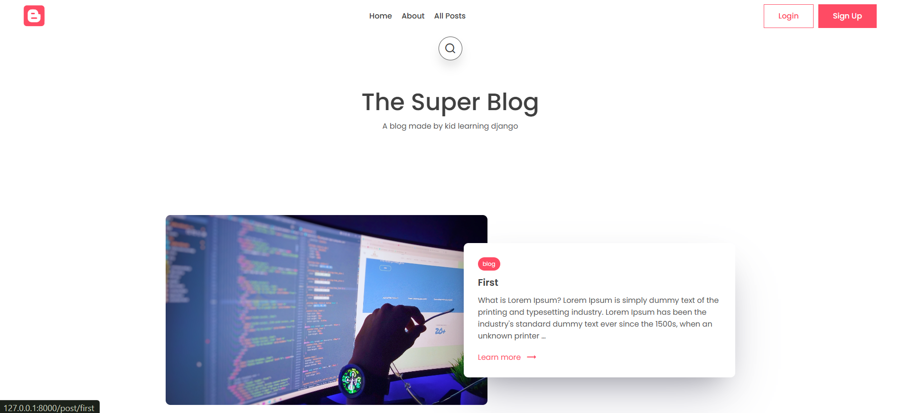
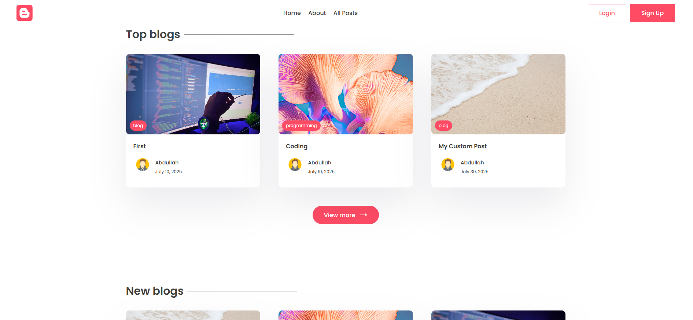
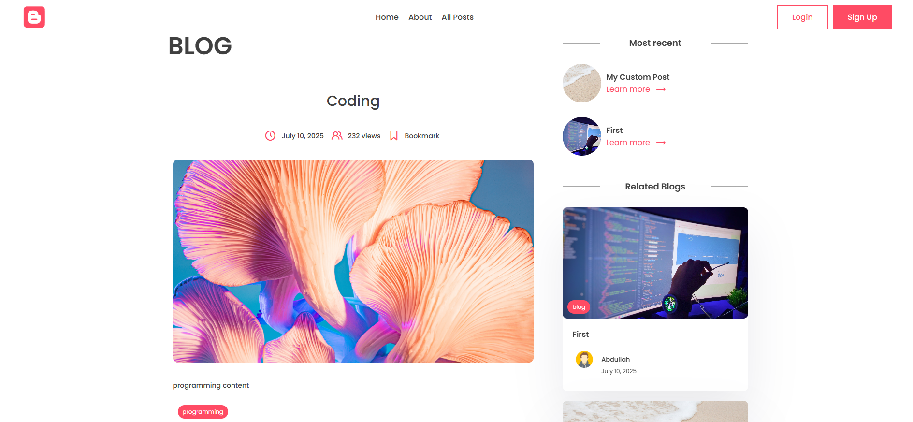

# 📝 Django Blog Application

A fully-functional blog application built with **Django**.  
This project supports posts, likes, bookmarks, comments, author profiles, subscriptions, and authentication.

---

## 🚀 Features

- User registration & login system
- Create, edit, and delete blog posts
- Author profile pages with slugs
- Like & bookmark functionality
- Commenting system with delete option
- Subscribe / unsubscribe to newsletter
- Responsive design with custom CSS
- Admin panel for managing content

---

## 📸 Screenshots

### Home Page

### Post

---

🔑 URL Routes

- / → Home page

- /about/ → About page

- /all_posts/ → All blog posts

- /author/<slug>/ → Author profile

- /author/<slug>/posts/create/ → Create post

- /author/<slug>/posts/<id>/edit/ → Edit post

- /author/<slug>/posts/<id>/delete/ → Delete post

- /bookmark/<slug>/ → Bookmark a post

- /likes/<slug>/ → Like a post

- /all_bookmarks/ → View all bookmarks

- /all_likes/ → View all likes

/subscribe/ → Subscribe

/unsubscribe/ → Unsubscribe
